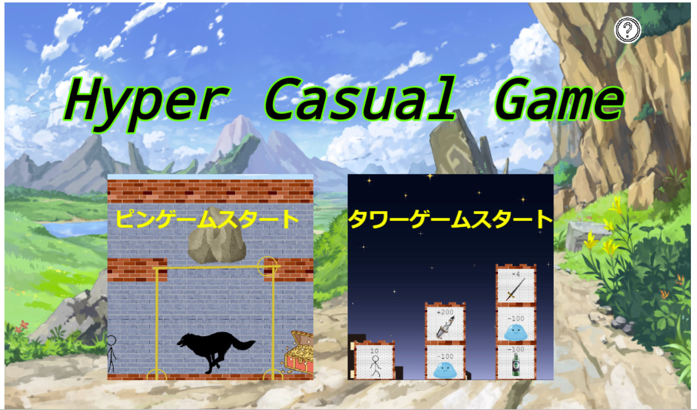

### ハイパーカジュアルゲーム
co0e部　一年　
## ハイパーカジュアルゲームとは-098
 ユーザーの性別や年齢、国籍を問わず誰でも遊べるゲームのことです。  
 僕たちは特に広告でよく見るようなゲームを目指して作りました。
## 動機
広告で出てくるゲームは実際にやらせてもらえないことが多いので、やらせてもらえないなら自分達で作ってしまおう！と思い作りました。
## 使用技術
* javascript
* phaser.js
## 技術選定理由
* phaser.js
  * コミュニティが活発でよくバージョン更新が行われている
  * 無料で使える
## スタートメニュー説明
右上の？アイコンをクリックするとハイパーカジュアルゲームの説明が表示されます。  
ピンゲームの画像をクリックするとピンゲームが始まります。  
タワーゲームの画像をクリックするとタワーゲームが始まります。

## ピンゲーム説明
宝箱を獲得するとゲームクリア、狼に食われるとゲームオーバーです。  
ピンをクリックするとピンが抜けます。  
ピンを正しい順で抜くと、宝箱が取れます。  
ただし、ピンが抜けて無くなるまで次のピンを動かせません。  
<video controls playsinline width="100%" autoplay loop muted="true" src="" type="video/mp4" >
 Sorry, your browser doesn't support embedded videos.
</video>
## タワーゲーム説明
塔の中にいる敵やアイテムをクリックするとその位置にプレイヤーが動きます。  
敵の攻撃力をプレイヤーの攻撃力が上回っていたら、敵を倒して力を吸収します。
塔の敵をすべて倒しアイテムをすべて回収すると次の塔をクリックできるようになります。  
最後の塔の一番上にいるドラゴンを倒すとクリアです。  
<video controls playsinline width="100%" autoplay loop muted="true" src="" type="video/mp4" >
 Sorry, your browser doesn't support embedded videos.
</video>
## 今後の展望
* ステージを増やす
* タワーゲームの四則演算を微積などを使って難しくする
* 他の広告でよくあるゲームも作ってみる